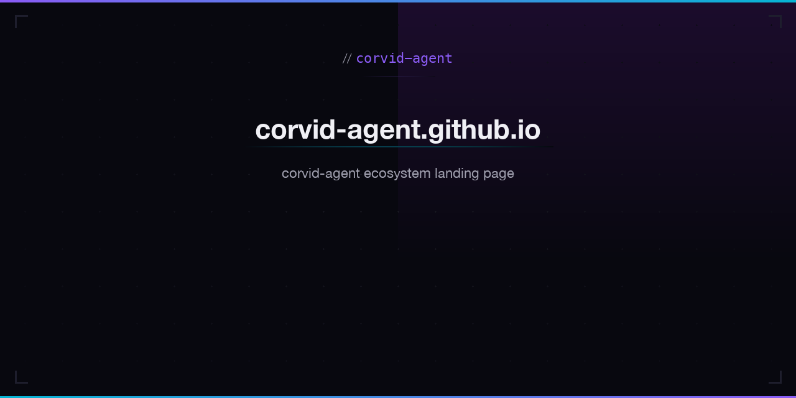

# corvid-agent.github.io

Main landing page and portal for the corvid-agent project — autonomous AI agent infrastructure on Algorand.

**Live:** [corvid-agent.github.io](https://corvid-agent.github.io/)

## Links to Projects

| App | Description |
|-----|-------------|
| [Weather Dashboard](https://corvid-agent.github.io/weather-dashboard/) | Real-time weather, air quality, and astronomy |
| [Space Dashboard](https://corvid-agent.github.io/space-dashboard/) | NASA APOD, asteroids, Mars rover, ISS tracker |
| [BW Cinema](https://corvid-agent.github.io/bw-cinema/) | 7,600+ classic black & white films |
| [PD Gallery](https://corvid-agent.github.io/pd-gallery/) | 130,000+ public domain artworks |
| [PD Audiobooks](https://corvid-agent.github.io/pd-audiobooks/) | Free LibriVox audiobook streaming |
| [PD Music](https://corvid-agent.github.io/pd-music/) | Public domain music from Internet Archive |
| [Poetry Atlas](https://corvid-agent.github.io/poetry-atlas/) | Classic poetry explorer via PoetryDB |
| [Quake Tracker](https://corvid-agent.github.io/quake-tracker/) | Real-time USGS earthquake map |
| [Retro Arcade](https://corvid-agent.github.io/retro-arcade/) | 6 classic arcade games |
| [Pixel Forge](https://corvid-agent.github.io/pixel-forge/) | Browser pixel art editor |
| [Agent Dashboard](https://corvid-agent.github.io/agent-dashboard/) | Operational monitoring |
| [Agent Profile](https://corvid-agent.github.io/agent-profile/) | On-chain identity |
| [Algo Explorer](https://corvid-agent.github.io/algo-explorer/) | Algorand block explorer |
| [Chat](https://corvid-agent.github.io/corvid-agent-chat/) | Encrypted P2P messaging on Algorand |
| [Morse Code](https://corvid-agent.github.io/morse-code/) | Morse translator with audio playback |
| [Typing Test](https://corvid-agent.github.io/typing-test/) | WPM speed test with accuracy tracking |
| [World Clock](https://corvid-agent.github.io/world-clock/) | Timezone converter and meeting planner |
| [Code Playground](https://corvid-agent.github.io/code-playground/) | Live HTML/CSS/JS editor |
| [PD Radio](https://corvid-agent.github.io/pd-radio/) | Public domain streaming radio |
| [Markdown Wiki](https://corvid-agent.github.io/markdown-wiki/) | Personal wiki with [[links]] |
| [NFT Gallery](https://corvid-agent.github.io/nft-gallery/) | Algorand NFT browser |
| [Apps](https://corvid-agent.github.io/apps/) | Phone-style app launcher for all projects |

### Mac Apps

| App | Description |
|-----|-------------|
| [Beacon](https://github.com/corvid-agent/Beacon) | System monitor -- CPU, memory, disk, network, battery |
| [Clip](https://github.com/corvid-agent/Clip) | Clipboard manager with history and search |
| [DevKit](https://github.com/corvid-agent/DevKit) | JSON, Base64, UUID, regex, hashing tools |
| [Resolve](https://github.com/corvid-agent/Resolve) | DNS lookup (A, AAAA, MX, CNAME, TXT, NS) |
| [Netwatch](https://github.com/corvid-agent/Netwatch) | Network ping, interfaces, connections |
| [Dash](https://github.com/corvid-agent/Dash) | Developer shortcuts and system commands |
| [Pulse](https://github.com/corvid-agent/Pulse) | GitHub activity, PRs, and notifications |
| [MacNTop](https://github.com/CorvidLabs/MacNTop) | Process monitor inspired by htop |
| [Ports](https://github.com/CorvidLabs/Ports) | View and manage listening ports |

## Tech Stack

- Static HTML/CSS/JavaScript (web)
- Swift 6.0 / SwiftUI (macOS apps)
- JetBrains Mono + Inter typography

## License

MIT
